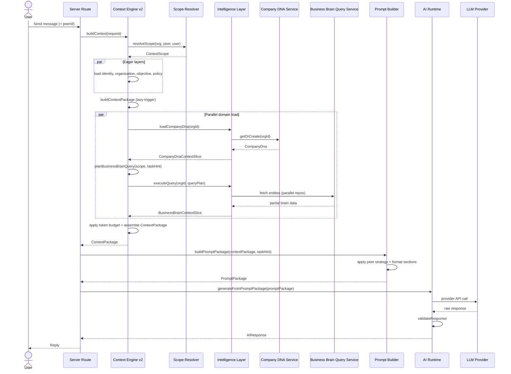
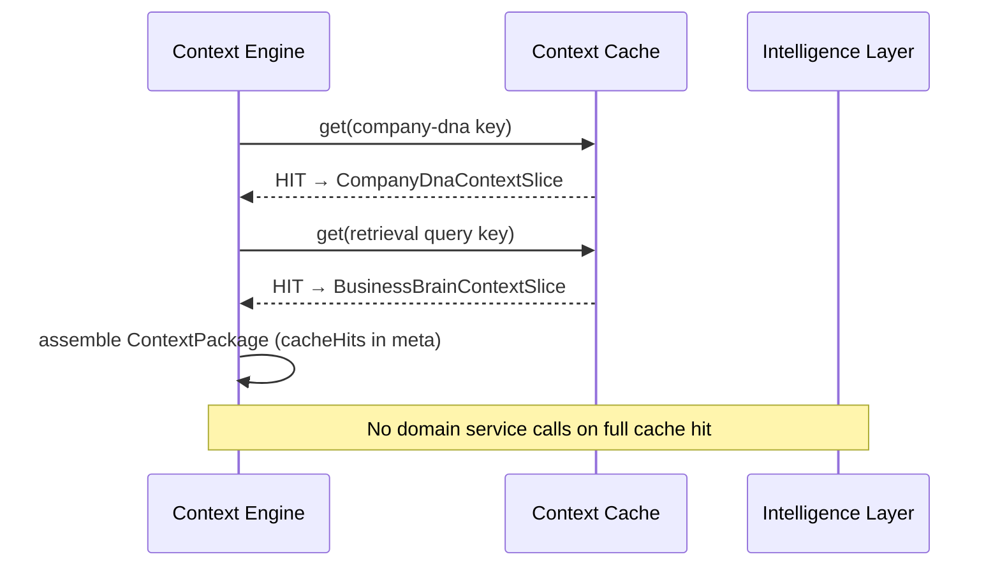
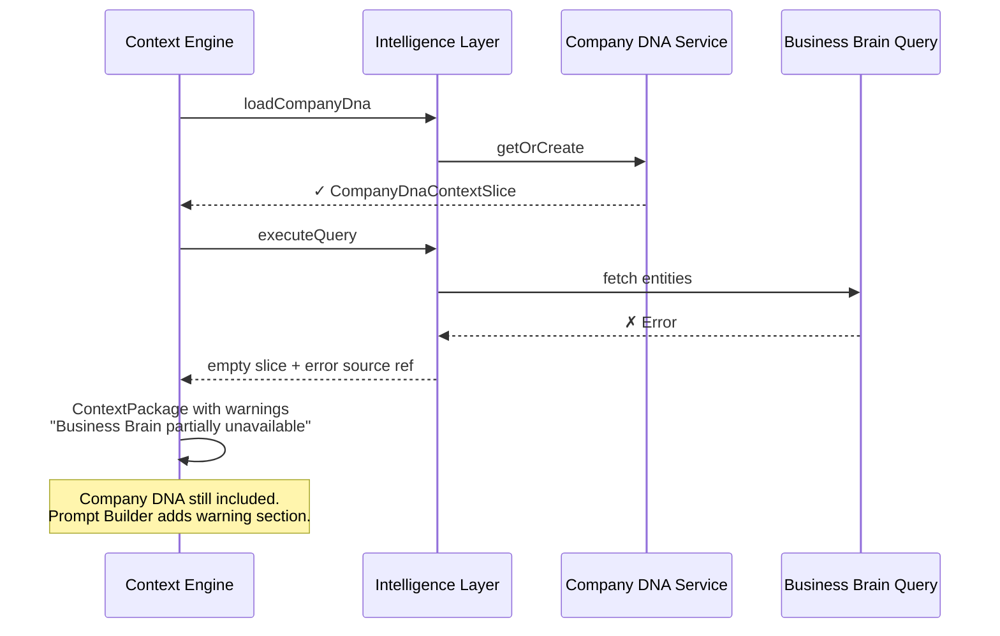
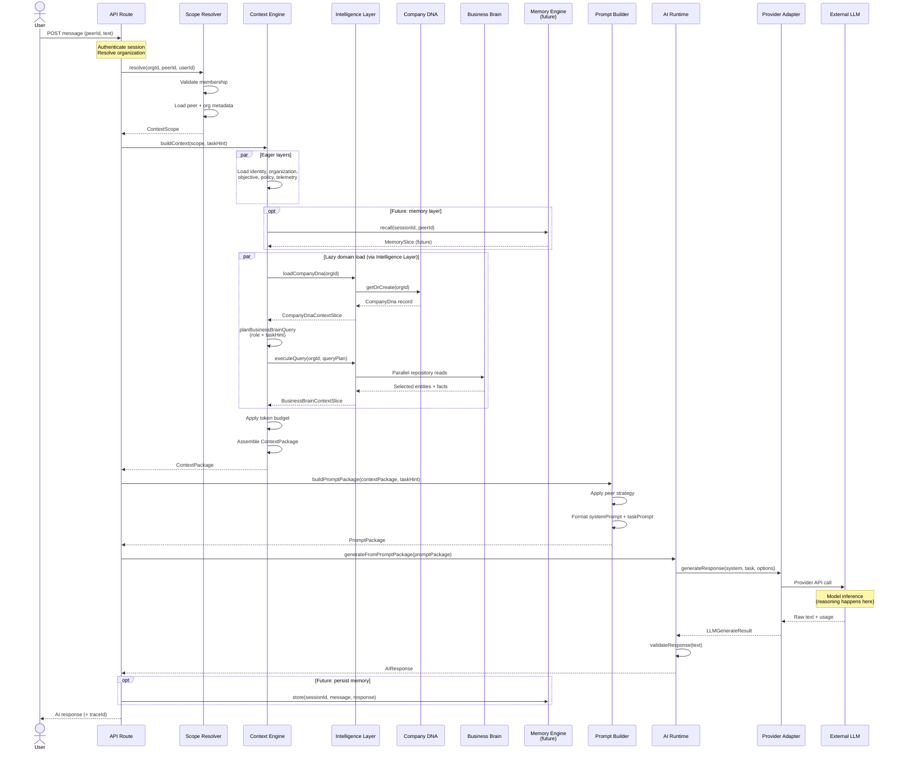

# Context Engine v2 — Architecture Document

**Status:** Design (Sprint 8)  
**Baseline:** Sprint 7 approved architecture (Company DNA + Business Brain + Intelligence layer)  
**Scope:** Architecture only — no implementation in this sprint

---

## 1. Executive summary

Context Engine v2 is the orchestration layer that assembles **model-agnostic context** for every AI interaction. It **consumes** Company DNA and Business Brain through the Intelligence layer but **never owns** that data or embeds prompt/model logic.

The engine produces a **Context Package** — a structured, provenance-tracked snapshot — which the **Prompt Builder** renders into provider-specific prompts, and the **AI Runtime** executes.

v2 replaces the current website-intelligence-derived `brain` layer with first-class **`company-dna`** and **`business-brain`** layers, adds **selective retrieval** instead of full aggregate dumps, and formalizes caching, security, and multi-model boundaries.

---

## 2. Responsibilities of the Context Engine

### 2.1 What the Context Engine owns

| Responsibility | Description |
|----------------|-------------|
| **Scope resolution** | Validate org/peer/user membership; produce immutable `ContextScope` |
| **Layer orchestration** | Eager vs lazy loading; parallel fetch; merge into `ContextBundle` |
| **Domain consumption** | Call Intelligence adapters that read Company DNA + Business Brain services |
| **Retrieval planning** | Decide *which* business knowledge is relevant for this request |
| **Context Package assembly** | Normalize domain data into a stable, versioned structure |
| **Provenance** | Attach `SourceRef` to every slice; support audit and debugging |
| **Cache management** | TTL-aware caching per layer and per retrieval query |
| **Completeness metadata** | Report loaded/missing/pending layers without blocking on stubs |

### 2.2 What the Context Engine does NOT own

| Out of scope | Owner |
|--------------|-------|
| Company DNA persistence | `lib/company-dna/` |
| Business Brain persistence | `lib/business-brain/` |
| Prompt wording / role strategies | `lib/prompt-builder/` |
| Model API calls | `lib/ai-runtime/` |
| Knowledge ingestion pipeline | Future sprint |
| Opportunity Engine | Future sprint |

### 2.3 Relationship to v1

v1 established: loader registry, eager/lazy split, `ContextBundle`, in-memory cache, Prompt Builder integration. v2 **extends** this — it does not replace the orchestration model.

**v1 gaps v2 closes:**

- Brain layer reads website intelligence, not `lib/business-brain/`
- No Company DNA loader exists
- Knowledge/memory/tools/policy layers are stubs
- Two incompatible `PromptPackage` types
- Full-brain projection with no retrieval strategy
- Client-side-only context building in dev playgrounds

---

## 3. How Company DNA is loaded

### 3.1 Loader design

A dedicated **`company-dna` loader** (lazy by default, eager when peer role requires tone/risk guidance) calls:

```
CompanyDnaService.getOrCreate(organizationId)
```

via an Intelligence adapter — **never** Supabase directly from the loader. The adapter maps `CompanyDna` → `CompanyDnaContextSlice` (engine-facing projection).

### 3.2 Load characteristics

| Property | Value | Rationale |
|----------|-------|-----------|
| Granularity | Full record | Small singleton (~1–3 KB); splitting adds complexity without token savings |
| TTL | 30 minutes | Changes infrequently; longer cache safe |
| Invalidation | On PATCH `/api/company-dna` (future webhook/event) | Org-scoped bust |
| Priority | 60 | After identity/org, before business brain |
| Eager trigger | Peer roles: Sales, Marketing, Support | Communication-heavy roles need tone/values upfront |

### 3.3 Projection shape (`CompanyDnaContextSlice`)

Semantic fields only — no DB metadata exposed to prompts:

- `mission`
- `values[]` (name, description, priority)
- `toneOfVoice` (summary, personality, dos/donts)
- `riskProfile` (tolerance, constraints, escalation rules)
- `decisionPrinciples[]`

### 3.4 Independence guarantee

Company DNA loader has **zero imports** from Business Brain. If Business Brain fails to load, Company DNA still resolves. The Context Package marks partial completeness but does not conflate the two.

---

## 4. How Business Brain is queried

### 4.1 Principle: query, don't dump

Business Brain aggregates can grow large (many products, facts, sources). v2 **never** loads the full `BusinessBrainAggregate` into context by default. Instead, a **Business Brain Query Planner** produces a scoped query from:

1. **Peer role** (Sales → segments, competitors, products; Operations → processes)
2. **Task hint** (user message or explicit task string)
3. **Retrieval budget** (max entities, max facts, max tokens per category)

### 4.2 Query interface

The Intelligence layer exposes a read-only facade (future `BusinessBrainQueryService`):

```
planQuery(scope, taskHint, roleStrategy) → BusinessBrainQuery
executeQuery(supabase, organizationId, query) → BusinessBrainContextSlice
```

Query dimensions:

| Dimension | Example |
|-----------|---------|
| `includeEntityTypes` | `["products", "competitors", "facts"]` |
| `factFilters` | `{ minImportance: "medium", verifiedOnly: false }` |
| `factLimit` | 20 |
| `segmentLimit` | 3 |
| `sourceLimit` | 5 (metadata only — no pipeline ingestion) |
| `searchTerms` | Extracted from task hint |

Implementation reuses existing repositories; the query service is a **read orchestrator**, not new persistence.

### 4.3 Loader design

**`business-brain` loader** (lazy):

1. Resolve brain root via `BusinessBrainService.getOrCreateBrain()`
2. Run query planner
3. Execute parallel repository reads (not `getAggregate()`)
4. Map to `BusinessBrainContextSlice` with entity counts and truncation flags

### 4.4 Website intelligence (transitional)

Website intelligence assessments remain available as an **optional enrichment source** under the `knowledge` layer in a later sprint — not merged into Business Brain loader. v2 explicitly **decouples** from `assessmentToBrainSnapshot()`.

---

## 5. Retrieval strategy

### 5.1 Retrieval pipeline

```
Task Hint + Peer Role
        ↓
   Intent Classifier (rule-based v2; ML optional later)
        ↓
   Query Plan (entity types, limits, filters)
        ↓
   Entity Fetch (parallel repository calls)
        ↓
   Relevance Ranker
        ↓
   Budget Trimmer
        ↓
BusinessBrainContextSlice
```

### 5.2 Intent classification (v2 — rule-based)

Start with deterministic rules to avoid model dependency in the retrieval path:

| Signal | Boost entities |
|--------|----------------|
| Role = Sales | customer segments, competitors, products |
| Role = Marketing | segments, products, knowledge sources |
| Role = Support | services, internal processes, facts |
| Keywords: "competitor", "vs" | competitors |
| Keywords: "pricing", "product" | products, services |
| Keywords: "process", "workflow" | internal processes |
| Default | top-N facts by importance + 2 segments + 3 products |

**Trade-off:** Rule-based is predictable and testable but misses nuance. Defer embedding/LLM-based retrieval to v3 when Knowledge Pipeline exists.

### 5.3 Fact ranking

Facts scored by:

```
score = importanceWeight + confidenceWeight + verifiedBonus + keywordMatchBoost
```

Sorted descending; hard cap by query plan `factLimit`.

### 5.4 Knowledge sources in v2

Sources included as **registry metadata only** (title, type, URL/ref) — no content extraction. Marks which sources *exist* so the AI can reference them without pretending to have read them.

### 5.5 Empty and sparse states

| State | Behavior |
|-------|----------|
| No brain record | Auto-create empty brain; slice marks `available: false` |
| Brain exists, no entities | `available: true`, `sparse: true`, warnings in meta |
| Query returns zero matches | Include role defaults + completeness warning |

---

## 6. Context Package structure

### 6.1 Separation from Prompt Package

| Artifact | Purpose | Consumer |
|----------|---------|----------|
| **Context Package** | Semantic, model-agnostic context | Prompt Builder, logging, replay |
| **Prompt Package** | Provider-ready strings | AI Runtime |

v2 unifies the two conflicting `PromptPackage` types from v1 by making Context Package the **upstream contract**.

### 6.2 Context Package schema (v2.0)

```typescript
type ContextPackage = {
  version: "2.0";
  traceId: string;
  scope: ContextScope;
  slices: {
    identity?: IdentitySlice;
    organization?: OrganizationSlice;
    objective?: ObjectiveSlice;
    companyDna?: CompanyDnaContextSlice;
    businessBrain?: BusinessBrainContextSlice;
    policy?: PolicySlice;
    peerType?: PeerTypeSlice;
    // knowledge, memory, tools — future layers
  };
  retrieval: {
    taskHint?: string;
    queryPlan?: BusinessBrainQueryPlan;
    truncated: boolean;
    truncationReasons?: string[];
  };
  meta: {
    completeness: number;
    loadedLayers: ContextLayerKey[];
    missingLayers: ContextLayerKey[];
    warnings: string[];
    sources: SourceRef[];
    assembledAt: string;
    cacheHits: string[];
  };
};
```

### 6.3 Layer key changes

| v1 | v2 | Notes |
|----|-----|-------|
| `brain` | `business-brain` | Structured domain data |
| — | `company-dna` | New layer |
| `knowledge` | `knowledge` | Reserved for pipeline (stub in v2) |
| `telemetry` | `telemetry` | Never in Context Package slices exposed to Prompt Builder |

`ContextBundle` remains the internal assembly structure; `ContextPackage` is the **exported contract** after normalization.

### 6.4 Versioning

`version: "2.0"` enables Prompt Builder and downstream consumers to handle schema evolution without breaking org data.

---

## 7. Token optimization strategy

### 7.1 Budget model

Define a **context token budget** per request tier:

| Tier | Target context tokens | Use case |
|------|----------------------|----------|
| Standard | ~2,000 | Peer chat default |
| Extended | ~4,000 | Analysis tasks |
| Minimal | ~800 | Quick replies, low-latency |

Budget enforced at Context Package assembly, before Prompt Builder.

### 7.2 Optimization techniques (ordered)

1. **Selective retrieval** — primary lever; don't load unused entities
2. **Role-based field filtering** — Peer Prompt Strategy selects slice fields (existing pattern)
3. **Structured compression** — bullet lists over prose; omit empty optional fields
4. **Fact cap + importance threshold** — drop low-importance facts first
5. **Truncation flags** — honest metadata ("12 more facts omitted") vs silent drop
6. **Lazy layer loading** — don't load business brain until needed
7. **Summarization tier (v2.1+)** — optional pre-summarization for large entity sets; not in initial v2

### 7.3 What we avoid in v2

- **LLM-based context compression** in the hot path — adds latency, cost, and model dependency
- **Embedding retrieval** — requires Knowledge Pipeline infrastructure

### 7.4 Trade-off: honesty vs completeness

Truncation flags increase token usage slightly but reduce hallucination risk. v2 prefers **explicit gaps** over silent omission.

---

## 8. Caching strategy

### 8.1 Cache layers

| Cache | Key pattern | TTL | Invalidation |
|-------|-------------|-----|--------------|
| Company DNA slice | `org:{id}:layer:company-dna:v2` | 30 min | DNA update event |
| Business Brain root ID | `org:{id}:brain-id:v2` | 60 min | Brain create (once) |
| Retrieval result | `org:{id}:peer:{id}:query:{hash}:v2` | 15 min | Any brain entity CRUD |
| Identity/Org/Objective | existing v1 keys | 5 min | Peer/org update |
| Empty brain | **Not cached** | — | v1 pattern retained |

Query hash = `hash(role + taskHint + queryPlanVersion)`.

### 8.2 v1 → v2 migration

Extend existing `MemoryContextCache` — same interface, new keys. Process-local cache remains acceptable for v2 single-instance deployments.

### 8.3 Production path (v2.1)

External cache (Redis/Upstash) keyed by org ID for horizontal scale. Not required for v2 MVP if server-side context route runs co-located.

### 8.4 Trade-off: staleness vs latency

15-minute retrieval cache means new facts may not appear immediately. Acceptable for v2; CRUD routes should emit cache-bust events when low-latency is required.

---

## 9. Security boundaries

### 9.1 Trust zones

```
┌─────────────────────────────────────────────────────────┐
│  UNTRUSTED: User input (task hint, chat messages)       │
└──────────────────────────┬──────────────────────────────┘
                           │ sanitized task hint only
┌──────────────────────────▼──────────────────────────────┐
│  CONTEXT ENGINE (trusted orchestrator)                    │
│  - Scope validation                                       │
│  - Org isolation                                          │
│  - Layer inclusion rules                                  │
└──────────┬─────────────────────────────┬────────────────┘
           │ read-only                    │ Context Package
┌──────────▼──────────┐      ┌───────────▼────────────────┐
│  DOMAIN SERVICES     │      │  PROMPT BUILDER             │
│  (RLS-enforced)      │      │  (no DB access)             │
└──────────────────────┘      └───────────┬────────────────┘
                                          │ Prompt Package
                              ┌───────────▼────────────────┐
                              │  AI RUNTIME (external API)  │
                              └────────────────────────────┘
```

### 9.2 Rules

| Rule | Enforcement |
|------|-------------|
| Org isolation | Scope resolver + RLS; cache keys include org ID |
| No cross-tenant cache | Key schema mandatory org prefix |
| Telemetry never in prompts | `PROMPT_SECURITY_EXCLUDED_LAYERS` |
| Server-side context in production | Context Engine runs on server with session auth |
| Domain services read-only from engine | No mutations during context build |
| Task hint sanitization | Strip control chars; max length 2 KB |
| Provenance required | Every slice has ≥1 SourceRef |
| AI Runtime never touches DB | Receives Prompt Package only |

### 9.3 Actor context

Membership role from scope may **filter** policy layer content (future) but must not bypass RLS.

---

## 10. Multi-model support

### 10.1 Model-agnostic design

```
Context Package (semantic JSON)
        ↓
Prompt Builder (provider-neutral sections → provider-specific formatting)
        ↓
Prompt Package { systemPrompt, taskPrompt, metadata }
        ↓
AI Runtime → Provider Adapter (OpenAI, Claude, …)
        ↓
AIResponse
```

### 10.2 Provider adapter interface (existing, extended)

Each adapter receives `LLMGenerateRequest`:

- `systemPrompt`, `taskPrompt`
- `model`, `temperature`, `maxTokens`
- Optional provider-specific `options`

Context Engine and Prompt Builder **never** reference provider APIs.

### 10.3 Model-specific adjustments (Prompt Builder scope)

| Concern | Where handled |
|---------|---------------|
| Token counting | Prompt Builder metadata (chars × heuristic; precise per model optional) |
| System vs user split | Prompt Builder knows provider preference via `ModelProfile` |
| Context window limits | Budget trimmer uses `ModelProfile.maxContextTokens` |
| Structured output | AI Runtime validator — not Context Engine |

### 10.4 Model profiles (v2)

```typescript
type ModelProfile = {
  id: string;
  provider: "openai" | "anthropic" | "generic";
  maxContextTokens: number;
  prefersSystemInstructions: boolean;
  defaultMaxOutputTokens: number;
};
```

GPT and Claude adapters selected at runtime via env or per-peer config — not hardcoded in Context Engine.

### 10.5 Trade-off: lowest common denominator vs optimization

Shared Context Package means some provider-specific optimizations (Claude prompt caching, OpenAI structured outputs) live in Prompt Builder / Runtime — not in domain layers. Acceptable separation of concerns.

---

## 11. Sequence diagrams

### 11.1 Standard peer chat request (full pipeline)



### 11.2 Cache hit path



### 11.3 Partial failure (Business Brain unavailable)



### 11.4 Layer responsibility separation

```mermaid
flowchart LR
    subgraph Domains["Domain Layer (owned data)"]
        DNA[Company DNA]
        BB[Business Brain]
    end

    subgraph Intelligence["Intelligence Layer (integration)"]
        Adapters[Domain Adapters]
        Query[BB Query Service]
        Snapshot[OrgIntelligenceSnapshot type]
    end

    subgraph CE["Context Engine v2 (orchestration)"]
        Loaders[Loaders]
        Retrieve[Retrieval Planner]
        CP[Context Package]
    end

    subgraph AI["AI Layer (consumption)"]
        PB[Prompt Builder]
        AR[AI Runtime]
    end

    DNA --> Adapters
    BB --> Query
    Adapters --> Loaders
    Query --> Loaders
    Loaders --> Retrieve
    Retrieve --> CP
    CP --> PB
    PB --> AR

    style Domains fill:#1a1a2e
    style Intelligence fill:#16213e
    style CE fill:#0f3460
    style AI fill:#533483
```



---

## 12. v2 layer registry (target state)

| Layer | Mode | TTL | Source |
|-------|------|-----|--------|
| identity | eager | 5m | Supabase peers |
| organization | eager | 5m | Supabase orgs |
| objective | eager | 5m | Supabase peers |
| policy | eager | 5m | Config stub → real policies later |
| telemetry | eager | 5m | Session (never in prompts) |
| **company-dna** | lazy* | 30m | Company DNA service |
| **business-brain** | lazy | 15m | BB query service |
| peer-type | lazy | 15m | Role modules |
| knowledge | lazy | — | Stub (pipeline future) |
| memory | lazy | — | Stub (future) |
| tools | lazy | — | Stub (future) |

\*Eager for communication-heavy peer roles.

**Removed:** v1 `brain` layer (website intelligence projection).

---

## 13. Design challenges and trade-offs

### 13.1 Separate layers vs merged "intelligence" slice

**Decision:** Separate `company-dna` and `business-brain` layers.

| Option | Pros | Cons |
|--------|------|------|
| Separate layers ✓ | Honors domain independence; independent cache/TTL; selective inclusion | More loader complexity |
| Merged slice | Simpler bundle | Violates Sprint 7 separation; couples cache invalidation |

### 13.2 Full aggregate vs selective query

**Decision:** Selective query by default.

| Option | Pros | Cons |
|--------|------|------|
| Selective query ✓ | Token efficient; scales with data growth | Requires query planner maintenance |
| Full aggregate | Simple implementation | Breaks at scale; wastes tokens |

### 13.3 Rule-based vs embedding retrieval

**Decision:** Rule-based for v2.

Embeddings require Knowledge Pipeline, vector store, and add non-determinism. Rules are testable and sufficient until fact/knowledge volume grows.

### 13.4 Context Package vs Prompt Package merge

**Decision:** Keep separate.

Semantic context should be loggable/replayable without provider formatting. Prompt Builder stays replaceable per model.

### 13.5 Server vs client context building

**Decision:** Server-side for production.

Client-side (current dev playground) exposes org data assembly to browser. v2 production route uses `getAuthenticatedOrgContext()` + server Supabase client.

### 13.6 Breaking change: `brain` → `business-brain` + `company-dna`

**Justification:** Compelling reason exists — Sprint 7 approved architecture. Migration path:

- Prompt Builder peer strategies updated to reference new layer keys
- `buildBusinessBrainSection` → split into `buildCompanyDnaSection` + `buildBusinessBrainSection`
- Deprecate website intelligence adapter from brain layer (keep module for Website Intelligence UI)

---

## 14. Out of scope for v2

- Knowledge Pipeline (ingestion, chunking, embedding)
- Opportunity Engine
- LLM-based retrieval or summarization
- Distributed cache (Redis)
- Real-time cache invalidation webhooks
- Memory and tools layers (remain stubs)
- Automated fact extraction from sources

---

## 15. Success criteria (for implementation sprint)

1. Every production AI request builds context server-side via Context Engine v2
2. Company DNA and Business Brain loaded through Intelligence adapters only
3. Context Package schema versioned and logged with trace ID
4. Token budget enforced; truncation reported honestly
5. Prompt Builder consumes Context Package — no direct domain imports
6. GPT and Claude both work via AI Runtime adapters without Context Engine changes
7. v1 website-intelligence brain loader replaced, not duplicated

---

## 17. AI Execution Flow

This section defines the **end-to-end reference flow** for every AI interaction on Peergent. It builds on the approved Sprint 7 domain architecture and Sprint 8 Context Engine v2 design. It does not introduce new architectural decisions — it describes how approved components connect during a single request.

### 17.1 Overview

A user message triggers a **linear pipeline** with clear handoffs. No component skips a layer or reaches across boundaries. Domain data flows **up** through the Intelligence layer into the Context Engine; prompts flow **down** through the AI Runtime to an external model.

```
User Message
    → API Route
    → Scope Resolver
    → Context Engine (+ Company DNA & Business Brain via Intelligence layer)
    → Prompt Builder
    → AI Runtime
    → Provider Adapter
    → External LLM
    → AI Runtime (response processing)
    → API Route
    → User Response
```

Future components (Memory Engine, Planner / Chief of Staff) slot into defined extension points without changing domain ownership or the Context Package contract.

---

### 17.2 Component responsibilities

#### API Route

**Role:** HTTP boundary and orchestration entry point.

| Does | Does not |
|------|----------|
| Authenticate the user and resolve the active organization | Build context or prompts |
| Validate request shape (peer ID, message, optional task hint) | Call LLM providers directly |
| Invoke Scope Resolver, Context Engine, Prompt Builder, AI Runtime in sequence | Read Company DNA or Business Brain directly |
| Return the AI response (or structured error) to the client | Own business or DNA data |
| Attach trace ID for logging and replay | Perform retrieval or reasoning |

The API Route is a **thin coordinator**. All intelligence assembly happens in dedicated modules below it.

---

#### Scope Resolver

**Role:** Produce a validated, immutable **`ContextScope`** for the request.

| Does | Does not |
|------|----------|
| Confirm the user is a member of the organization | Load domain data |
| Load peer identity (role, name, objective, website) | Build prompts |
| Load organization metadata (name, slug) | Cache context slices |
| Attach actor context (user ID, membership role) | Call LLM providers |

Output: `ContextScope` — the security and identity anchor for the entire request. Every downstream component receives scope; none may override org or peer IDs.

---

#### Context Engine

**Role:** Orchestrate context assembly and produce the **Context Package**.

| Does | Does not |
|------|----------|
| Load eager layers (identity, organization, objective, policy, telemetry) | Persist domain data |
| Trigger lazy layers (company-dna, business-brain, peer-type) | Construct prompt strings |
| Plan and execute Business Brain retrieval (via Intelligence layer) | Call LLM providers |
| Apply token budget and truncation rules | Own Company DNA or Business Brain records |
| Assemble versioned **Context Package** with provenance | Perform model inference |

The Context Engine is the **retrieval and assembly orchestrator**. It decides *what* context is relevant; it does not decide *how* the model should phrase its answer.

---

#### Company DNA

**Role:** Domain store for how the company thinks, communicates, and decides.

| Does | Does not |
|------|----------|
| Persist mission, values, tone of voice, risk profile, decision principles | Participate in prompt construction |
| Serve read requests via `CompanyDnaService` | Perform retrieval planning |
| Enforce org-scoped RLS at the database layer | Call AI models |
| Return a complete DNA record per organization | Know about peers, tasks, or prompts |

Company DNA is **passive data**. The Context Engine consumes it through an Intelligence adapter; the domain never knows it is being used in an AI request.

---

#### Business Brain

**Role:** Domain store for business knowledge.

| Does | Does not |
|------|----------|
| Persist products, services, segments, competitors, processes, knowledge sources, facts | Dump full aggregates into AI context |
| Serve targeted reads via repositories and query service | Plan which facts are relevant |
| Enforce org-scoped RLS | Construct prompts or call models |
| Provide graph-ready entity IDs and fact triplets | Own conversation history |

Business Brain is **passive, queryable knowledge**. Selective retrieval is the Context Engine's responsibility, not the domain's.

---

#### Prompt Builder

**Role:** Transform Context Package into a provider-ready **Prompt Package**.

| Does | Does not |
|------|----------|
| Apply peer-role strategies (Sales, Marketing, etc.) | Load domain data |
| Select which context slices and fields appear in the prompt | Call LLM providers |
| Format sections as markdown (`systemPrompt`, `taskPrompt`) | Perform retrieval |
| Emit warnings (missing brain, truncated facts, sparse DNA) | Mutate domain records |
| Estimate character/token footprint | Execute model inference |

Prompt Builder is the **sole owner of prompt construction**. No other component produces strings sent to the model.

---

#### AI Runtime

**Role:** Execute model calls and process responses.

| Does | Does not |
|------|----------|
| Accept Prompt Package + runtime options (model, temperature, max tokens) | Build context or prompts |
| Delegate to the configured Provider Adapter | Query domains |
| Validate and sanitize model output (strip fences, truncate, malformed detection) | Plan multi-step tasks (future: Planner) |
| Return structured **AIResponse** with metadata (latency, usage, trace ID) | Store conversation memory (future: Memory Engine) |

AI Runtime is the **model execution and response processing boundary**. It is model-agnostic — it knows about providers, not about Company DNA or Business Brain.

---

#### Provider Adapter

**Role:** Translate Prompt Package into provider-specific API calls.

| Does | Does not |
|------|----------|
| Map `systemPrompt` / `taskPrompt` to provider format (OpenAI `instructions` + `input`, Claude `system` + `messages`, etc.) | Build prompts from domain data |
| Handle authentication, retries, rate limits for one provider | Validate business logic |
| Return raw text, finish reason, token usage, latency | Own response validation (delegated to AI Runtime) |

Each adapter implements a shared `LLMProvider` interface. Adding a model family means adding an adapter — Context Engine and Prompt Builder remain unchanged.

**Reasoning** (in the sense of language model inference) happens **inside the external LLM**, invoked by the Provider Adapter. No Peergent component performs generative reasoning in v2.

---

#### Future: Memory Engine *(placeholder)*

**Role:** Persistent conversation and interaction memory per peer/session.

| Will do | Will not do |
|---------|-------------|
| Store and retrieve conversation history, user preferences, past outcomes | Own Company DNA or Business Brain |
| Expose a `memory` context layer to the Context Engine | Construct prompts |
| Support selective recall (recent messages, key decisions) | Replace Business Brain facts |

**Extension point:** Context Engine `memory` loader (currently stub). Memory Engine writes asynchronously after response; reads occur during context assembly on subsequent requests.

---

#### Future: Planner / Chief of Staff *(placeholder)*

**Role:** Multi-step task orchestration above the single-request pipeline.

| Will do | Will not do |
|---------|-------------|
| Decompose complex user goals into sub-tasks | Own domain data |
| Decide whether a request needs multiple AI calls, tool use, or human approval | Replace Context Engine retrieval |
| Coordinate loops: plan → execute → evaluate → re-plan | Bypass Prompt Builder or AI Runtime |

**Extension point:** Sits **above** the API Route for orchestrated workflows. A simple peer chat message bypasses the Planner and flows directly through the standard pipeline described below.

---

### 17.3 Responsibility matrix

Which platform concern each component owns:

| Concern | Owner(s) | Notes |
|---------|----------|-------|
| **Retrieval** | Context Engine (+ Intelligence adapters querying Company DNA & Business Brain) | DNA: full load. Brain: selective query. Memory Engine adds conversational retrieval later. |
| **Prompt construction** | Prompt Builder | Only component that produces strings for the model. |
| **Model execution** | AI Runtime → Provider Adapter → External LLM | Runtime orchestrates; adapter translates; LLM generates. |
| **Reasoning** | External LLM | Generative inference is the model's job. Planner (future) orchestrates *when* to reason, not *how*. |
| **Response processing** | AI Runtime | Validation, sanitization, structured AIResponse. API Route handles HTTP framing. |

Peergent components **retrieve, assemble, instruct, and validate**. They do not generate language — that is delegated to the model.

---

### 17.4 End-to-end sequence

Standard peer chat request (Planner bypassed):



---

### 17.5 Architectural boundaries

```
┌─────────────────────────────────────────────────────────────────────┐
│  CLIENT                                                              │
└───────────────────────────────┬─────────────────────────────────────┘
                                │ HTTPS
┌───────────────────────────────▼─────────────────────────────────────┐
│  API ROUTE — auth, validation, pipeline coordination                 │
└───────────────────────────────┬─────────────────────────────────────┘
                                │
        ┌───────────────────────┼───────────────────────┐
        │                       │                       │
┌───────▼────────┐   ┌──────────▼──────────┐   ┌───────▼────────┐
│ Scope Resolver │   │  Context Engine v2  │   │ Future Planner │
│ (identity)     │   │  (retrieval +       │   │ (multi-step    │
│                │   │   assembly)         │   │  orchestration)│
└────────────────┘   └──────────┬──────────┘   └────────────────┘
                                │
                    ┌───────────┼───────────┐
                    │  Intelligence Layer     │
                    │  (read-only adapters)   │
                    └─────┬─────────────┬─────┘
                          │             │
              ┌───────────▼──┐   ┌──────▼───────────┐
              │ Company DNA  │   │ Business Brain   │
              │ (domain)     │   │ (domain)         │
              └──────────────┘   └──────────────────┘

                                ContextPackage
┌───────────────────────────────▼─────────────────────────────────────┐
│  PROMPT BUILDER — prompt construction only                         │
└───────────────────────────────┬─────────────────────────────────────┘
                                │ PromptPackage
┌───────────────────────────────▼─────────────────────────────────────┐
│  AI RUNTIME — execution + response processing                        │
└───────────────────────────────┬─────────────────────────────────────┘
                                │
┌───────────────────────────────▼─────────────────────────────────────┐
│  PROVIDER ADAPTER — provider-specific API translation                │
└───────────────────────────────┬─────────────────────────────────────┘
                                │
┌───────────────────────────────▼─────────────────────────────────────┐
│  EXTERNAL LLM — generative reasoning                                 │
└─────────────────────────────────────────────────────────────────────┘
```

**Boundary rules:**

1. **Domains never call up.** Company DNA and Business Brain expose services; they do not import Context Engine, Prompt Builder, or AI Runtime.

2. **Context Engine never calls providers.** It stops at Context Package. Prompt strings are Prompt Builder's output.

3. **Prompt Builder never touches the database.** It receives Context Package only.

4. **AI Runtime never assembles context.** It receives Prompt Package only.

5. **Intelligence Layer is the only path** from Context Engine to domains. Direct repository imports from Prompt Builder or AI Runtime are forbidden.

6. **Future components respect the same boundaries.** Memory Engine integrates via a Context Engine loader slot. Planner orchestrates API Route calls — it does not embed into Context Engine or domains.

---

### 17.6 Request phases

For implementation reference, a single AI request passes through five distinct phases:

| Phase | Components | Output |
|-------|------------|--------|
| **1. Authentication & scope** | API Route → Scope Resolver | `ContextScope` |
| **2. Context assembly** | Context Engine → Intelligence Layer → Company DNA & Business Brain | `ContextPackage` |
| **3. Prompt construction** | Prompt Builder | `PromptPackage` |
| **4. Model execution** | AI Runtime → Provider Adapter → External LLM | Raw model output |
| **5. Response processing** | AI Runtime → API Route | `AIResponse` → user |

Phases are **sequential**. Phase 2 cannot begin without scope. Phase 3 cannot begin without Context Package. Phase 4 cannot begin without Prompt Package. This ordering is fixed across all peer roles and model providers.

---

### 17.7 Error handling across boundaries

| Failure point | Behavior | User impact |
|---------------|----------|-------------|
| Auth / scope | 401/403 from API Route | Request rejected; no AI call |
| Company DNA load fails | Context Package with warning; DNA slice empty | Peer responds with reduced personality grounding |
| Business Brain load fails | Context Package with warning; brain slice sparse | Peer responds with honesty about limited knowledge |
| Token budget exceeded | Truncation flags in Context Package | Peer may omit detail; warnings in prompt |
| Prompt Builder error | 500 from API Route | Request rejected; no AI call |
| Provider / LLM error | AI Runtime error metadata | Graceful error message to user |
| Response validation fails | AIResponse with `validated.success: false` | Empty or fallback text; logged for review |

Partial context failures **do not block** the request unless scope or prompt construction fails entirely. This matches the v2 principle of honest partial context over hard failure.

---

## 18. Glossary

| Term | Definition |
|------|------------|
| **Context Package** | Model-agnostic assembled context (v2 contract) |
| **Context Bundle** | Internal engine assembly structure (v1, retained) |
| **Prompt Package** | Provider-ready prompts for AI Runtime |
| **Slice** | Single layer's typed data + provenance |
| **Query Plan** | Retrieval specification for Business Brain |
| **Intelligence Layer** | Integration facade between domains and Context Engine |

| **AI Execution Flow** | End-to-end pipeline from user message to AI response (§17) |
| **Provider Adapter** | Provider-specific LLM API translator consumed by AI Runtime |

---

*Document version: 1.1 — Sprint 8 Design Phase (AI Execution Flow added)*
